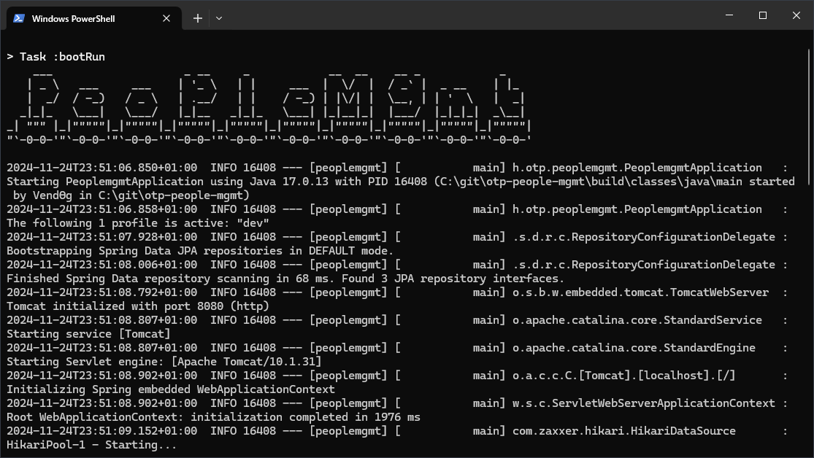
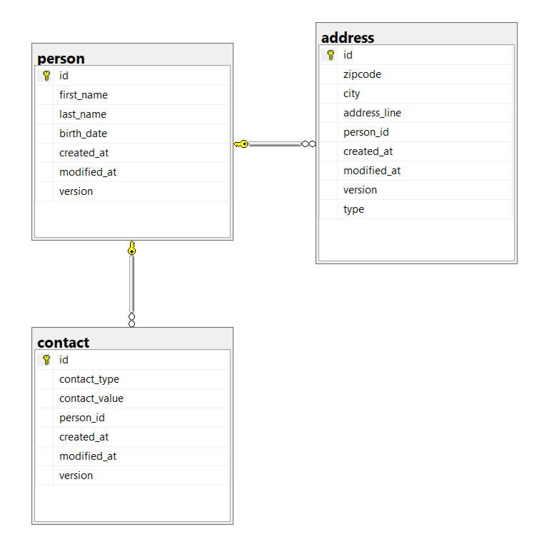

<a id="readme-top" name="readme-top"></a>

<!-- PROJECT LOGO -->
<br />
<div align="center">
    

  <h3 align="center">OTP People Management</h3>
  <p align="center">
    A solution for managing people and their personal data efficiently.
  </p>
</div>

<!-- TABLE OF CONTENTS -->
<details>
  <summary>Table of Contents</summary>
  <ol>
    <li>
      <a href="#about-the-project">About The Project</a>
      <ul>
        <li><a href="#built-with">Built With</a></li>
      </ul>
    </li>
    <li>
      <a href="#getting-started">Getting Started</a>
      <ul>
        <li><a href="#prerequisites">Prerequisites</a></li>
        <li><a href="#installation">Installation</a></li>
      </ul>
    </li>
    <li>
      <a href="#project-structure">Project Structure</a>
      <ul>
        <li><a href="#key-components-of-the-app">Key Components of the App</a></li>
      </ul>
    </li>
    <li><a href="#database-structure">Database structure</a></li>
    <li><a href="#tests">Tests</a></li>
  </ol>
</details>

---

## About The Project

This project is a home assignment for an OTP Java Developer job application. It is a comprehensive people administration and management application developed using Spring Boot. The app provides functionality for handling personal data, backed by a structured database and RESTful APIs.

<br />
<div align="center">
    
</div>

### Built With

This console application has been built using **Spring Boot 3.3.5** with **Java 17**. Below is a list of key tools and libraries utilized in the project (refer to `build.gradle` for details):

- **Spring Web**: Framework for building REST APIs.
- **Spring Data (JPA, Hibernate)**: Tools for managing database interactions.
- **Liquibase**: Database migration and version control tool.
- **OpenAPI Swagger**: Documentation and testing utility for APIs.
- **Log4J**: Enterprise-grade logging framework.
- **JUnit**: Framework for unit testing.
- **Mockito**: Mocking framework for creating test data and behaviors.
- **Testcontainers**: Tool for managing containerized test environments.
- **Docker**: Used for running containerized services, such as Microsoft SQL Server 2019 for development and integration testing.

<p align="right">(<a href="#readme-top">back to top</a>)</p>

---

## Getting Started

Follow the steps below to set up and run the project locally.

### Prerequisites

Ensure the following are installed on your machine:

1. **JDK 17**: Required to compile and run the application.
2. **Docker**: Used to run the database in a containerized environment, essential for integration testing.
3. If using the provided [Dockerfile and `dbconf.sql`](./docker), ensure Docker is installed to set up the development database.

### Installation

1. **Clone the repository**:
   ```sh
   git clone https://github.com/b8nyiand/otp-people-mgmt.git
   ```

2. **Build and run the Docker container**:
   Navigate to the `docker` folder and execute the following commands in a terminal window.
   ```sh
   docker build --tag mssql-devdb:241121 .
   docker run --publish 11433:1433 --detach --name devdb mssql-devdb:241121
   ```
   - Verify the container is running using Docker Desktop or CLI.
   - Test the database connection using Microsoft SQL Server Management Studio (credentials are in the Dockerfile).

   > **Note**: This Docker setup simplifies the local database initialization for development and testing.

   Alternatively:
   - If you already have a local MS SQL Server instance, configure the connection string and credentials in `application-dev.yml`.
   - You can find a [`devdb_export.bacpac`](./data) database export file in the respository, if you wish to restore development database copy with dummy data manually.
   - Use the statements in [`dbconf.sql`](./docker) to create the necessary database structure.

3. **Build the project**:
   ```sh
   ./gradlew build
   ```
   - Ensure Docker Engine is running, as integration tests require containerized dependencies.
   - To skip tests during the build process, add the `-x test` option.

4. **Run the application**:
   ```sh
   ./gradlew bootRun
   ```
   The command automatically runs the application in `dev` profile. For the development specific settings (setting up the database connection) you have to create an `application-dev.yml` file and specify the settings there:
   ```yml
   spring:
     datasource:
       url: 'jdbc:sqlserver://localhost:<port>;encrypt=true;trustServerCertificate=true;databaseName=<db name>'
       username: <username>
       password: <password>
   ```

5. **Explore the API**:
   - Access the Swagger UI in your browser at: `http://localhost:8080/swagger-ui/index.html` (port may vary depending on your setup).
   - Use Swagger, Postman, or any REST client to test the endpoints.

> **Optional**: Import the project into IntelliJ IDEA, set up the database, and execute the application or tests within the IDE.

<p align="right">(<a href="#readme-top">back to top</a>)</p>

---

## Project Structure

The project adheres to the standard Spring Boot structure:

- **`RestControllers`**: Handle HTTP requests and forward them to the `Service` layer.
- **`Services`**: Contain the business logic and bridge the `RestControllers` and `Repositories`.
- **`Repositories`**: Represent the data access layer, managing database queries.

Each layer is thoroughly tested to ensure proper functionality.

### Key Components of the App

#### Configuration

- [`application.yml`](./src/main/resources/application.yml): Application configuration.
- [`log4j2.xml`](./src/main/resources/log4j2.xml): Logging configuration.
- [`db.changelog`](./src/main/resources/db/changelog/): Liquibase scripts for database setup and initial data.

#### Application

- [`hu.otp.peoplemgmt.config`](./src/main/java/hu/otp/peoplemgmt/config/): Application-related configurations (e.g., Swagger).
- [`hu.otp.peoplemgmt.controller`](./src/main/java/hu/otp/peoplemgmt/controller/): REST controllers.
- [`hu.otp.peoplemgmt.domain`](./src/main/java/hu/otp/peoplemgmt/domain/): Entities representing database tables.
- [`hu.otp.peoplemgmt.repository`](./src/main/java/hu/otp/peoplemgmt/repository/): Data access layer.
- [`hu.otp.peoplemgmt.service`](./src/main/java/hu/otp/peoplemgmt/service/): Business logic layer.
- [`hu.otp.peoplemgmt.exception`](./src/main/java/hu/otp/peoplemgmt/exception/): Error handling classes.
- [`PeoplemgmtApplication`](./src/main/java/hu/otp/peoplemgmt/): Entry point of the application.

#### Testing

- [`application-test.yml`](./src/test/resources/application-test.yml): Configuration for tests.
- Integration tests for controllers: [`hu.otp.peoplemgmt.controller`](./src/test/java/hu/otp/peoplemgmt/controller/).
- Repository unit tests: [`hu.otp.peoplemgmt.repository`](./src/test/java/hu/otp/peoplemgmt/repository/).
- Service unit tests: [`hu.otp.peoplemgmt.service`](./src/test/java/hu/otp/peoplemgmt/service/).

<p align="right">(<a href="#readme-top">back to top</a>)</p>

---

## Database structure

* `person`: Table that stores basic data of a person, identified by a string type primary key.
* `address`: Table that stores addresses, identified by a bigint type primary key. One person can hold one or more addresses, it's implemented via a foreign key constraint. (The numerousity of exactly two addresses per person is implemented programmatically on the application level.)
* `contact`: Table that stores contacts, identified by a bigint type primary key. One person can hold one or more contacts, it's implemented via a foreign key constraint.

Each table holds automatically generated audit data (`created_at`, `modified_at`, `version`).

See the ERD below for the concrete database schema.

<br />
<div align="center">
    
</div>
<br />

The database setup is automated with Liquibase changelogs:

- **DDL**: Refer to changelogs 1, 2, and 3 for table creation scripts.
- **DML**: Initial test data is seeded through changelog 4.

On application startup, the database structure and initial data are configured automatically.


<p align="right">(<a href="#readme-top">back to top</a>)</p>

---

## Tests

Comprehensive tests are implemented to ensure correctness:

- **Integration Tests**: Run in a containerized environment.
- **Unit Tests**: Cover service and repository layers.
- All tests are executed during the build process, ensuring reliability.

Test code is organized in the [`src/test`](./src/test) directory.

<p align="right">(<a href="#readme-top">back to top</a>)</p>
